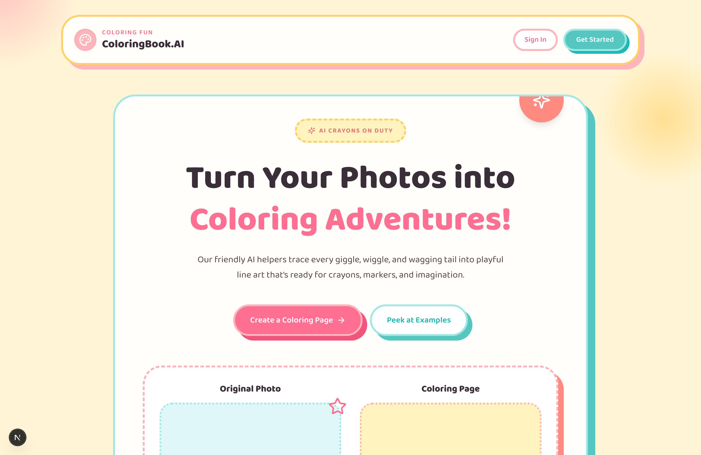
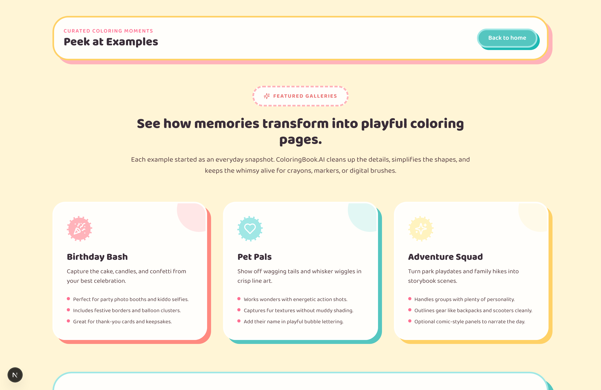
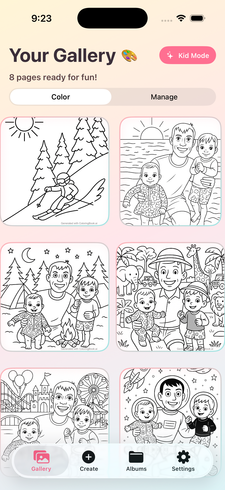

# 🎨 ColoringBook.AI

Transform any photo into a beautiful coloring page with AI-powered technology. Available as a **Next.js web app**, a **native iOS/iPadOS app**, and a **native Android app**. Perfect for family memories, gifts, or creative fun!

[](https://nextjs.org/)
[](https://www.typescriptlang.org/)
[](https://supabase.com/)
[](https://openai.com/)
[](https://tailwindcss.com/)
[](https://swift.org/)
[](https://developer.apple.com/ios/)
[](https://kotlinlang.org/)
[](https://developer.android.com/)

## 📸 Screenshots

### Web — Landing Page



### Web — Example Gallery



### iOS — iPhone



### iOS — iPad


## ✨ Features

### 🤖 AI-Powered Processing
- **Smart Line Art Generation**: OpenAI and Google Gemini APIs convert photos into clean black-and-white line art
- **Provider Benchmarks**: Built-in `/api/evaluate-image-providers` endpoint compares output quality, latency, and cost across providers side-by-side
- **Prompt Remix**: Regenerate coloring pages with different styles, complexity levels, and custom prompts
- **Real-time Status Updates**: Live progress tracking during AI processing via Supabase subscriptions
- **Automatic Watermarking**: Professional watermark applied to all generated images via Sharp

### 👨‍👩‍👧‍👦 Family & Sharing
- **Family Albums**: Create and share coloring page collections with unique share codes
- **Social Sharing**: Share individual pages to Twitter, Facebook, and WhatsApp via unique short links
- **Photobook Creator**: Combine multiple coloring pages into PDF collections (up to 20 pages)
- **Instant Download**: Get print-ready coloring pages within minutes

### 🎛️ User Management
- **Dashboard**: Manage all your coloring pages with status tracking and bulk operations
- **Real-time Updates**: Live status updates using Supabase real-time subscriptions with fallback polling
- **Image Variants**: Generate style variants of a single photo and compare them side-by-side

### 📱 iOS App (Native)
- **Digital Coloring Canvas**: Color directly on your device with Apple Pencil support, multiple brush types, and undo/redo
- **AR Gallery**: View your coloring pages in augmented reality using ARKit
- **Kid Mode**: PIN-protected parental control mode that locks the app to coloring only
- **Offline-First**: Continue coloring without an internet connection; sync when back online
- **Universal**: Optimized for both iPhone and iPad with dark mode support

### 🤖 Android App (Native)
- **Digital Coloring Canvas**: Touch and stylus drawing with colors, brush sizes, and undo/redo
- **Kid Mode**: PIN-locked coloring-only experience for children
- **Family Albums**: Create and share coloring page albums with share codes
- **Offline Support**: Room database caching for offline viewing
- **Authentication**: Email/password login via Supabase Auth

## 🏗️ Tech Stack

### Web
- **Framework**: Next.js 15 with App Router & TypeScript
- **Styling**: Tailwind CSS 4
- **Database**: Supabase with real-time subscriptions
- **Authentication**: Supabase Auth with React Context
- **AI Processing**: OpenAI Responses API + Google Gemini image generation
- **Storage**: Supabase Storage
- **Image Processing**: Sharp for watermarking and manipulation
- **PDF Generation**: jsPDF for photobook creation
- **Monitoring**: Sentry for error tracking and performance
- **Deployment**: Vercel

### iOS
- **Language**: Swift 6 / SwiftUI
- **Minimum Deployment**: iOS 16
- **Backend**: Supabase (shared with web app)
- **AI**: OpenAI API via the same backend API routes
- **AR**: ARKit for the AR Gallery feature
- **Monitoring**: Sentry Cocoa SDK
- **Project Generation**: XcodeGen (`project.yml`)

### Android
- **Language**: Kotlin 2.1 / Jetpack Compose (Material 3)
- **Minimum SDK**: API 26 (Android 8.0)
- **Architecture**: MVVM + Repository pattern with Hilt DI
- **Backend**: Supabase Kotlin SDK (shared with web app)
- **AI**: Delegates to shared Next.js API routes
- **Offline**: Room database + DataStore preferences
- **Image Loading**: Coil
- **Monitoring**: Sentry Android SDK
- **Build**: Gradle Kotlin DSL with version catalogs

## 🚀 Quick Start

### Web App

#### Prerequisites
- Node.js 18+
- A Supabase account
- An OpenAI API key
- (Optional) A Google Gemini API key for Gemini-based image generation and benchmarking

#### Installation

1. **Clone the repository**
   ```bash
   git clone https://github.com/pierceboggan/coloring-book.git
   cd coloring-book
   ```

2. **Install dependencies**
   ```bash
   npm install
   ```

3. **Set up environment variables**
   
   Create a `.env.local` file in the root directory:
   ```env
   # Supabase Configuration
   NEXT_PUBLIC_SUPABASE_URL=your_supabase_url
   NEXT_PUBLIC_SUPABASE_ANON_KEY=your_supabase_anon_key
   SUPABASE_SERVICE_ROLE_KEY=your_supabase_service_key

   # OpenAI Configuration
   OPENAI_API_KEY=your_openai_api_key

   # Gemini Configuration (optional)
   GOOGLE_API_KEY=your_gemini_api_key
   GEMINI_IMAGE_MODEL=gemini-2.5-flash-image-preview
   GEMINI_API_BASE_URL=https://generativelanguage.googleapis.com/v1beta

   # Image Generation Defaults (optional)
   IMAGE_GENERATION_PROVIDER=openai
   OPENAI_IMAGE_COST_USD=0.00
   GEMINI_IMAGE_COST_USD=0.00

   # App Configuration
   NEXT_PUBLIC_APP_URL=http://localhost:3000
   ```

4. **Set up Supabase**
   
   Run this SQL in your Supabase SQL editor:
   ```sql
   -- Create images table
   CREATE TABLE images (
     id UUID DEFAULT gen_random_uuid() PRIMARY KEY,
     user_id TEXT NOT NULL,
     original_url TEXT NOT NULL,
     coloring_page_url TEXT,
     created_at TIMESTAMP WITH TIME ZONE DEFAULT NOW(),
     updated_at TIMESTAMP WITH TIME ZONE DEFAULT NOW(),
     name TEXT NOT NULL,
     status TEXT CHECK (status IN ('uploading', 'processing', 'completed', 'error')) DEFAULT 'uploading'
   );

   -- Create storage bucket for images
   INSERT INTO storage.buckets (id, name, public) VALUES ('images', 'images', true);

   -- Set up RLS policies
   ALTER TABLE images ENABLE ROW LEVEL SECURITY;
   CREATE POLICY "Users can insert images" ON images FOR INSERT WITH CHECK (true);
   CREATE POLICY "Users can view images" ON images FOR SELECT USING (true);
   CREATE POLICY "Users can update their images" ON images FOR UPDATE USING (user_id = 'anonymous' OR auth.uid()::text = user_id);

   -- Storage policies
   CREATE POLICY "Anyone can upload images" ON storage.objects FOR INSERT WITH CHECK (bucket_id = 'images');
   CREATE POLICY "Anyone can view images" ON storage.objects FOR SELECT USING (bucket_id = 'images');
   ```

5. **Run the development server**
   ```bash
   npm run dev
   ```

6. **Open your browser**

   Visit [http://localhost:3000](http://localhost:3000)

   > **Note**: The development environment is password-protected with: `parkcityutah`

### iOS App

#### Prerequisites
- macOS with Xcode 15.0+
- iOS 16.0+ device or simulator
- Homebrew (for XcodeGen)

#### Installation

1. **Install XcodeGen**
   ```bash
   brew install xcodegen
   ```

2. **Generate the Xcode project**
   ```bash
   cd ios/ColoringBook
   xcodegen generate
   ```

3. **Open in Xcode**
   ```bash
   open ColoringBook.xcodeproj
   ```

4. **Configure environment variables**

   In Xcode, select the `ColoringBook` scheme and add these to the scheme's environment variables (or set them in `Info.plist`):
   ```
   SUPABASE_URL=your_supabase_url
   SUPABASE_ANON_KEY=your_supabase_anon_key
   OPENAI_API_KEY=your_openai_api_key
   SENTRY_DSN=your_sentry_dsn  # optional
   ```

5. **Run on simulator or device**

   Press `Cmd+R` in Xcode or select your target device and click Run.

> **Note**: The iOS app shares the same Supabase backend as the web app. See [ios/AGENTS.md](ios/AGENTS.md) for detailed iOS development instructions.

### Android App

#### Prerequisites
- Android Studio (latest stable)
- Android SDK with API 26+
- A Supabase account (shared backend with web/iOS)

#### Installation

1. **Open in Android Studio**
   ```bash
   # Open the android/ folder in Android Studio
   ```

2. **Configure Supabase credentials**

   Copy `local.properties.example` and add your credentials:
   ```properties
   SUPABASE_URL=https://your-project.supabase.co
   SUPABASE_ANON_KEY=your-anon-key
   ```

3. **Sync and run**

   Sync Gradle and run on a device or emulator (API 26+).

> **Note**: The Android app shares the same Supabase backend as the web and iOS apps. See [android/AGENTS.md](android/AGENTS.md) for detailed Android development instructions.

## 🔬 Evaluating image providers

Use the `/api/evaluate-image-providers` route to compare OpenAI and Gemini results side-by-side. The endpoint accepts the same `imageUrl` you send to the standard generator and optionally a custom prompt, target age, detail level, or explicit provider list.

```http
POST /api/evaluate-image-providers
Content-Type: application/json

{
  "imageUrl": "https://example.com/source-photo.jpg",
  "age": 6,
  "providers": ["openai", "gemini"],
  "prompt": "Keep the composition playful but faithful to the original photo."
}
```

Each provider response contains the public URL for the generated page plus timing, usage, and cost metadata so you can track quality versus spend.

## 🚀 Deploy to Vercel

### One-Click Deploy

[](https://vercel.com/new/clone?repository-url=https%3A%2F%2Fgithub.com%2Fbogganpierce%2Fcoloringbook)

### Manual Deployment

1. **Push to GitHub**
   ```bash
   git add .
   git commit -m "Initial commit"
   git push origin main
   ```

2. **Connect to Vercel**
   - Visit [Vercel Dashboard](https://vercel.com/dashboard)
   - Click "New Project"
   - Import your GitHub repository
   - Vercel will auto-detect Next.js settings

3. **Configure Environment Variables**
   
   Add these in your Vercel project settings:
   ```env
   NEXT_PUBLIC_SUPABASE_URL=your_supabase_url
   NEXT_PUBLIC_SUPABASE_ANON_KEY=your_supabase_anon_key
   SUPABASE_SERVICE_ROLE_KEY=your_supabase_service_key
   OPENAI_API_KEY=your_openai_api_key
   NEXT_PUBLIC_APP_URL=https://your-domain.vercel.app
   ```

4. **Deploy**
   - Click "Deploy"
   - Vercel will build and deploy automatically
   - Your app will be live at `https://your-project.vercel.app`

### Vercel CLI Alternative

```bash
# Install Vercel CLI
npm i -g vercel

# Login and deploy
vercel login
vercel

# Add environment variables
vercel env add NEXT_PUBLIC_SUPABASE_URL
vercel env add NEXT_PUBLIC_SUPABASE_ANON_KEY
vercel env add SUPABASE_SERVICE_ROLE_KEY
vercel env add OPENAI_API_KEY
vercel env add NEXT_PUBLIC_APP_URL

# Deploy to production
vercel --prod
```

## 🔧 Configuration

### Environment Variables

| Variable | Description | Required |
|----------|-------------|----------|
| `NEXT_PUBLIC_SUPABASE_URL` | Your Supabase project URL | ✅ |
| `NEXT_PUBLIC_SUPABASE_ANON_KEY` | Supabase anonymous key | ✅ |
| `SUPABASE_SERVICE_ROLE_KEY` | Supabase service role key (server-side only) | ✅ |
| `OPENAI_API_KEY` | OpenAI API key with access to the Responses API | ✅ |
| `NEXT_PUBLIC_APP_URL` | Your app's public URL (used for share links and redirects) | ✅ |
| `GOOGLE_API_KEY` | Google Gemini API key for alternative image generation | ⬜ |
| `GEMINI_IMAGE_MODEL` | Gemini model ID (e.g. `gemini-2.5-flash-image-preview`) | ⬜ |
| `GEMINI_API_BASE_URL` | Gemini API base URL | ⬜ |
| `IMAGE_GENERATION_PROVIDER` | Default provider: `openai` or `gemini` | ⬜ |
| `OPENAI_IMAGE_COST_USD` | Cost per image for OpenAI (used in evaluation reports) | ⬜ |
| `GEMINI_IMAGE_COST_USD` | Cost per image for Gemini (used in evaluation reports) | ⬜ |

### Supabase Configuration

1. **Storage Bucket**: Create a public bucket named `images`
2. **RLS Policies**: Set up row-level security for user data protection
3. **Real-time**: Enable real-time subscriptions for live updates

### OpenAI Configuration

- Ensure your API key has access to the **Responses API** (not DALL-E directly)
- The system uses base64 image input for processing
- Custom prompts are supported for regeneration

## 🐛 Troubleshooting

### Common Issues

**Images not processing:**
- Check OpenAI API key and organization access
- Verify Supabase storage policies are public
- Check browser console for error messages

**Real-time updates not working:**
- Ensure Supabase real-time is enabled
- Check network connectivity
- Verify subscription setup in code

**Deployment issues:**
- Confirm all environment variables are set
- Check Vercel build logs
- Verify Supabase project is accessible

### Debug Logging

The app includes extensive console logging with emoji indicators:
- 🚀 Process started
- ✅ Success
- ❌ Error
- 🔄 Processing

Check browser console and Vercel logs for detailed information.

## 🧪 Testing

ColoringBook.AI includes comprehensive unit tests with 80%+ code coverage. See [TESTING.md](./TESTING.md) for detailed testing guidelines.

### Running Tests

```bash
# Run all unit tests
npm run test:unit

# Run tests in watch mode
npm test

# Run tests with coverage report
npm run test:coverage

# Open Vitest UI for interactive testing
npm run test:ui

# Run E2E tests
npm run test:e2e
```

### Test Coverage

The project maintains 80%+ coverage across:
- **Library utilities**: variants, image processing, PDF generation, type serialization
- **Components**: UI components with React Testing Library
- **End-to-end**: Critical user workflows with Playwright

Coverage reports are generated in `coverage/` directory after running `npm run test:coverage`.

## 🔧 API Reference

### Core Endpoints

| Method | Endpoint | Description |
|--------|----------|-------------|
| `POST` | `/api/generate-coloring-page` | Main AI processing — converts uploaded photo to a coloring page |
| `POST` | `/api/regenerate-coloring-page` | Regenerate with a custom prompt or style |
| `POST` | `/api/retry-processing` | Retry a failed image processing job |
| `DELETE` | `/api/images/[id]` | Delete an image and its coloring page |
| `GET` | `/api/download/[id]` | Download the coloring page with correct headers |

### Album & Sharing
| Method | Endpoint | Description |
|--------|----------|-------------|
| `POST` | `/api/family-albums` | Create a shareable family album |
| `GET` | `/api/family-albums/[shareCode]` | Access a shared album by code |
| `POST` | `/api/generate-photobook` | Generate a PDF photobook from multiple images |
| `POST` | `/api/share` | Create a public share link for an individual page |
| `GET` | `/api/share/[shareCode]` | Retrieve share data and increment view count |

### AI & Evaluation
| Method | Endpoint | Description |
|--------|----------|-------------|
| `POST` | `/api/evaluate-image-providers` | Compare OpenAI and Gemini side-by-side with timing, usage, and cost metadata |
| `POST` | `/api/prompt-remix` | Start an async prompt-remix job for batch style variants |
| `GET` | `/api/prompt-remix` | Poll the status of a running remix job |

### Mobile
| Method | Endpoint | Description |
|--------|----------|-------------|
| `*` | `/api/mobile/*` | Mobile-specific API routes used by the iOS and Android apps |

### Image Processing Flow
1. **Upload** → Image stored in Supabase Storage
2. **Database Insert** → Record created with `status: 'processing'`
3. **AI Processing** → OpenAI Responses API generates coloring page
4. **Watermarking** → Sharp library adds watermark
5. **Storage** → Processed image saved to Supabase Storage
6. **Status Update** → Real-time notification via Supabase subscriptions

## 🎯 Usage Examples

### Basic Upload & Processing
```typescript
// Upload image and start processing
const response = await fetch('/api/generate-coloring-page', {
  method: 'POST',
  headers: { 'Content-Type': 'application/json' },
  body: JSON.stringify({
    imageId: 'uuid-here',
    userId: 'user-id-here'
  })
});
```

### Custom Regeneration
```typescript
// Regenerate with custom prompt
const response = await fetch('/api/regenerate-coloring-page', {
  method: 'POST',
  headers: { 'Content-Type': 'application/json' },
  body: JSON.stringify({
    imageId: 'uuid-here',
    customPrompt: 'Create a simpler coloring page with fewer details'
  })
});
```

### Real-time Status Updates
```typescript
// Subscribe to real-time updates
const subscription = supabase
  .channel('images_changes')
  .on('postgres_changes', { 
    event: 'UPDATE', 
    schema: 'public', 
    table: 'images' 
  }, (payload) => {
    console.log('Image status updated:', payload.new);
  })
  .subscribe();
```

## Contributing

1. Fork the repository
2. Create a feature branch (`git checkout -b feature/my-feature`)
3. Make your changes — follow the conventions in [AGENTS.md](AGENTS.md) and [CONTRIBUTING.md](CONTRIBUTING.md)
4. Run linting and tests: `npm run lint && npm run test:unit`
5. Submit a pull request

For iOS contributions, see [ios/AGENTS.md](ios/AGENTS.md) for platform-specific guidelines.
For Android contributions, see [android/AGENTS.md](android/AGENTS.md) for platform-specific guidelines.

## License

This project is private and proprietary.