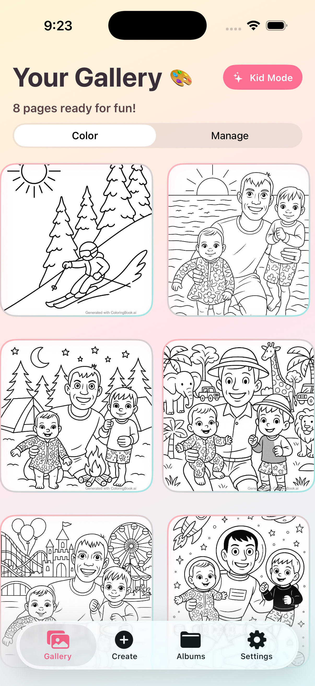

# ColoringBook.AI - iOS App

Transform any photo into a beautiful coloring page with AI-powered technology - now natively on your iPhone and iPad!

## 📸 iOS App Screenshots

### iPhone



### iPad


## ✨ Features

### 🎨 Digital Coloring Canvas
- **Apple Pencil Support**: Pressure-sensitive drawing with palm rejection on iPad
- **Multiple Brush Types**: Pen, marker, and brush tools
- **Color Palette**: 10 preset colors plus custom color picker
- **Undo/Redo**: 15-level drawing history
- **Save & Share**: Export to Photos library and share with family

### 🤖 AI-Powered Processing
- **Smart Line Art Generation**: OpenAI-powered image-to-coloring-page conversion
- **Real-time Updates**: Live progress tracking during processing
- **Offline Support**: Continue coloring even without internet
- **High Quality**: Professional watermark system

### 👨‍👩‍👧‍👦 Kid Mode
- **Parental Controls**: PIN-protected mode locks app to coloring only
- **Safe Environment**: No access to upload/manage features in kid mode
- **Fun UI**: Colorful, child-friendly interface
- **Easy Parent Access**: Hidden unlock button for adult supervision

### 📱 iOS-Optimized
- **Universal App**: Optimized for iPhone and iPad
- **Dark Mode**: Native dark mode support
- **Haptic Feedback**: Enhanced touch interactions
- **Photos Integration**: Direct save to Photos library
- **Offline-First**: Local persistence with cloud sync

## 🚀 Quick Start

### Requirements
- iOS 16.0 or later
- Xcode 15.0 or later
- Swift 5
- Supabase project
- OpenAI API key

### Installation

1. **Clone the repository**
   ```bash
   git clone https://github.com/pierceboggan/coloring-book.git
   cd coloring-book/ios/ColoringBook
   ```

2. **Generate the Xcode project**
   The project uses XcodeGen. Install it and generate the `.xcodeproj`:
   ```bash
   brew install xcodegen
   xcodegen generate
   ```

3. **Install dependencies**
   Dependencies are managed via Swift Package Manager and will be resolved automatically when you open the project in Xcode.

4. **Configure Supabase**
   - Create a Supabase project at [supabase.com](https://supabase.com/)
   - The iOS app shares the same Supabase backend as the web app
   - Copy your Supabase URL and anon key

5. **Set up Supabase Tables**
   The iOS app uses the same database schema as the web app:
   - `images` — user photos and generated coloring pages
   - `family_albums` — shared albums with share codes

6. **Configure Storage**
   - Uses the same Supabase Storage buckets as the web app
   - Ensure storage policies allow authenticated uploads

7. **Set Environment Variables**
   Add keys to the scheme environment variables in Xcode:
   - Edit Scheme → Run → Arguments → Environment Variables
   - Add `OPENAI_API_KEY` with your API key
   - Add `SUPABASE_URL` with your Supabase project URL
   - Add `SUPABASE_ANON_KEY` with your Supabase anon key

8. **Build and Run**
   - Open `ColoringBook.xcodeproj` in Xcode
   - Select your target device or simulator
   - Press `Cmd + R` to build and run

### Running Tests

```bash
# Unit tests
xcodebuild test -scheme ColoringBook -destination 'platform=iOS Simulator,name=iPhone 17'

# UI tests
xcodebuild test -scheme ColoringBook -destination 'platform=iOS Simulator,name=iPhone 17' -only-testing:ColoringBookUITests
```

## 🏗️ Architecture

### Tech Stack
- **UI Framework**: SwiftUI
- **Architecture**: MVVM (Model-View-ViewModel)
- **Backend**: Supabase (Auth, Database, Storage)
- **AI Processing**: OpenAI API
- **Drawing**: PencilKit
- **Monitoring**: Sentry for error tracking and performance monitoring
- **Dependency Management**: Swift Package Manager
- **Project Generation**: XcodeGen (`project.yml`)

### Project Structure
```
ColoringBook/
├── project.yml                # XcodeGen project definition
├── ColoringBook/              # Main app
│   ├── Models/               # Data models
│   ├── Views/                # SwiftUI views
│   ├── ViewModels/           # Business logic
│   ├── Services/             # Supabase & OpenAI services
│   ├── Utils/                # Helpers & extensions
│   └── Resources/            # Assets
├── ColoringBookTests/        # Unit tests
└── ColoringBookUITests/      # UI tests
```

### Key Components

**ColoringCanvasView**: The primary feature - digital coloring pad with PencilKit integration

**SupabaseService**: Centralized Supabase operations (Auth, Database, Storage) — shares the same backend as the web app

**OpenAIService**: AI image processing and watermarking

**SentryService**: Error tracking and performance monitoring

**KidModeView**: Parental control locked mode

## 🔧 Configuration

### Supabase Setup

The iOS app connects to the same Supabase project as the web app. Ensure these are configured:

1. **Authentication**
   - Enable Email/Password authentication
   - (Optional) Add Apple Sign In

2. **Database Tables**
   The `images` table schema (shared with web):
   ```sql
   -- images table
   id: uuid primary key
   user_id: text
   original_url: text
   coloring_page_url: text | null
   name: text
   status: text ('uploading' | 'processing' | 'completed' | 'error')
   created_at: timestamptz
   updated_at: timestamptz
   ```

3. **Storage**
   - Uses the same Supabase Storage buckets as the web app
   - RLS policies should allow authenticated users to upload/read

### OpenAI Configuration
- Requires OpenAI API key with access to image generation
- Uses the Responses API for coloring page generation
- Configurable prompt templates

### Sentry Configuration
1. **Create Sentry Project**
   - Sign up at [sentry.io](https://sentry.io/)
   - Create a new iOS project
   - Copy your DSN from the project settings

2. **Configure the App**
   - **Recommended**: Set the `SENTRY_DSN` environment variable in Xcode:
     - Edit Scheme → Run → Arguments → Environment Variables
     - Add `SENTRY_DSN` with your Sentry DSN
   - **Not recommended**: Update `project.yml` with your DSN (avoid for public repos as DSN will be committed)

3. **Features Enabled**
   - Automatic error tracking for crashes and exceptions
   - Performance monitoring for AI operations
   - Breadcrumb tracking for debugging context
   - User identification linked to Supabase auth
   - Screenshots attached to error reports

## 🐛 Troubleshooting

### Common Issues

**Build Errors:**
- Clean build folder: `Shift + Cmd + K`
- Reset package cache: `File → Packages → Reset Package Caches`
- Regenerate project: `xcodegen generate`

**Supabase Connection Issues:**
- Verify Supabase URL and anon key are set correctly
- Check that RLS policies allow the operation
- Ensure the Supabase project is active

**OpenAI API Errors:**
- Verify API key is correctly set
- Check API quota and billing
- Review OpenAI service logs

### Debug Logging
The app uses emoji-prefixed logs for easy identification:
- 🚀 Process started
- ✅ Success
- ❌ Error
- 🔄 Processing

## 📱 Deployment

### TestFlight
1. Archive the app in Xcode
2. Upload to App Store Connect
3. Add testers in TestFlight

### App Store
1. Complete App Store Connect setup
2. Prepare screenshots and metadata
3. Submit for review
4. Follow Apple's review guidelines

## 🧪 Testing

### Unit Tests
- Test business logic and view models
- Mock Supabase and OpenAI services
- Test model encoding/decoding

### UI Tests
- Test user flows and navigation
- Verify drawing interactions
- Test kid mode PIN protection

### Manual Testing Checklist
- [ ] Upload and process images
- [ ] Digital coloring with all brush types
- [ ] Save artwork to Photos
- [ ] Kid mode activation/deactivation
- [ ] Offline mode functionality
- [ ] iPad layout optimization
- [ ] Dark mode appearance

## 🎯 Roadmap

- [ ] iCloud sync
- [ ] Widgets
- [ ] Siri Shortcuts
- [ ] Share Extension
- [ ] Today Extension
- [ ] Apple Sign In
- [ ] Push notifications
- [ ] Advanced drawing (layers, blend modes)
- [ ] Social sharing
- [ ] In-app purchases

## 📄 License

This project is private and proprietary.

## 🤝 Contributing

1. Fork the repository
2. Create a feature branch
3. Make your changes
4. Write/update tests
5. Submit a pull request

## 📞 Support

- GitHub Issues: [Report a bug](https://github.com/pierceboggan/coloring-book/issues)
- Documentation: See `AGENTS.md` files

## 🙏 Acknowledgments

- Built with SwiftUI and Supabase
- Powered by OpenAI
- Uses PencilKit for drawing
